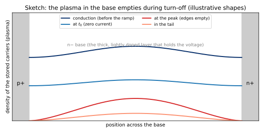
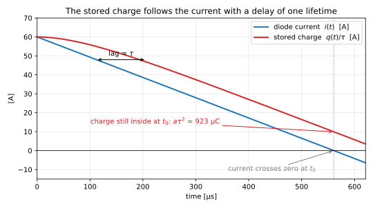
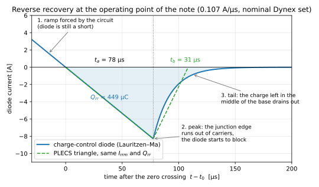
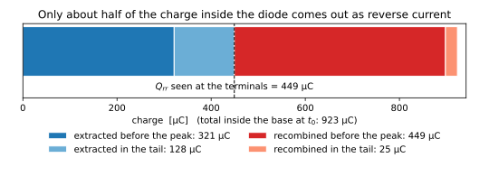
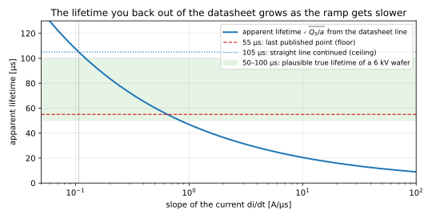
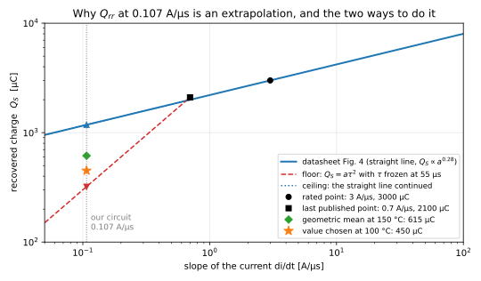
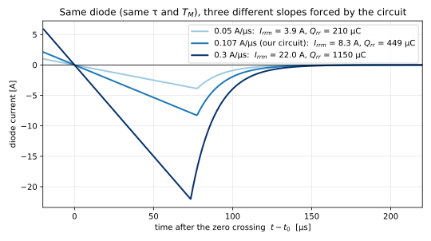
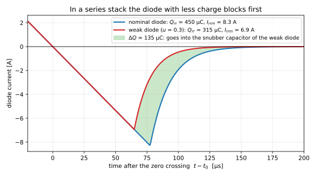

# The physics of diode reverse recovery, in plain English

**A companion to chapter 5 of the DS1112SG60 note** ([simple-English version](plecs_diode_parameters_ds1112sg_simple_english.md), [original PDF](original/plecs_diode_parameters_ds1112sg.pdf)).

This document explains *why* the formulas of chapter 5 are what they are. It is written for a power-electronics and control engineer. The main idea is that a power diode is a first-order system whose state is the charge stored inside it. Everything in chapter 5 (the lag $a\tau^2$, the apparent lifetime, the floor and the ceiling, the triangle, the $\sqrt{1-u}$ rule) follows from that one idea plus a little geometry.

All figures are computed with the nominal Dynex set of the note ($a$ = 0.107 A/µs, $I_{F0}$ = 60 A, $\tau$ = 93 µs, $T_M$ = 18.5 µs, which give $I_{rrm}$ = 8.3 A and $Q_{rr}$ = 450 µC). The script that makes them is [`scripts/make_figures.py`](scripts/make_figures.py).

## Contents

1. [The question chapter 5 answers](#1-the-question-chapter-5-answers)
2. [What is inside a 6 kV diode](#2-what-is-inside-a-6-kv-diode)
3. [Conduction: the base is flooded with charge](#3-conduction-the-base-is-flooded-with-charge)
4. [The charge equation is a first-order lag](#4-the-charge-equation-is-a-first-order-lag)
5. [The zero crossing: why the diode does not stop](#5-the-zero-crossing-why-the-diode-does-not-stop)
6. [The peak: the junction runs dry](#6-the-peak-the-junction-runs-dry)
7. [The tail](#7-the-tail)
8. [Where the charge goes: Q_rr is less than the charge inside](#8-where-the-charge-goes-q_rr-is-less-than-the-charge-inside)
9. [The apparent lifetime, the floor and the ceiling (§5.2 decoded)](#9-the-apparent-lifetime-the-floor-and-the-ceiling-52-decoded)
10. [Temperature](#10-temperature)
11. [The triangle and the PLECS constraint (§5.3 decoded)](#11-the-triangle-and-the-plecs-constraint-53-decoded)
12. [Why the recovery scales with di/dt](#12-why-the-recovery-scales-with-didt)
13. [Unbalance in a series stack (§5.4 decoded)](#13-unbalance-in-a-series-stack-54-decoded)
14. [The same story in three languages: physics, PLECS, Lauritzen–Ma](#14-the-same-story-in-three-languages-physics-plecs-lauritzenma)
15. [Ten things to remember](#15-ten-things-to-remember)

[Appendix A: the derivations](#appendix-a-the-derivations) · [Appendix B: about the figures](#appendix-b-about-the-figures)

---

## 1 The question chapter 5 answers

The datasheet of the DS1112SG tells you how the diode recovers at 3 A/µs with 1000 A flowing. Our rectifier turns the diode off at 0.107 A/µs with 60 A flowing. That is thirty times slower and seventeen times less current. Chapter 5 of the note has to answer: **what are $Q_{rr}$, $I_{rrm}$ and $t_{rr}$ at our operating point, when the datasheet does not go there?**

To extrapolate with confidence you need to know what is physically going on. That is what this document is about. Once the picture is clear, every formula of chapter 5 becomes a one-line consequence of it.

---

## 2 What is inside a 6 kV diode

A rectifier diode for thousands of volts is not a simple p-n junction. It has three layers:

- a thin, heavily doped **p+** layer (the anode side);
- a thick, very lightly doped **n− base** (also called the drift region or the i-region, as in "p-i-n diode");
- a thin, heavily doped **n+** layer (the cathode side).

The base is there to hold the voltage. When the diode blocks, the reverse voltage sits across the base, which becomes a depleted region with a strong electric field inside. Silicon can stand about 2 × 10⁵ V/cm before it breaks down. To hold 6 kV you need a base roughly half a millimetre thick or more, with a doping so low (around 10¹³ atoms per cm³) that the field spreads over the whole thickness instead of piling up at the junction.

This is the price of high voltage: **a thick base with almost no free carriers of its own.** On its own, such a base is a terrible conductor. A slab half a millimetre thick and 13 cm² in area with that doping would have a resistance of a couple of ohms. At 1000 A it would drop a couple of kilovolts. Real diodes drop about one volt. So something else must happen during conduction.

---

## 3 Conduction: the base is flooded with charge

When the diode conducts, the p+ layer injects holes into the base and the n+ layer injects electrons into it. The base fills up with a dense, electrically neutral cloud of electrons and holes, with a density a thousand times or more above the base doping. Engineers call this cloud the **plasma**, and the effect **conductivity modulation**. Now the base conducts very well, and the forward drop is about a volt.

The total amount of this cloud is the **stored charge** $q$. (Count the holes; the electrons mirror them, so the cloud is neutral and $q$ is one number.) Three facts about $q$ are the whole story of reverse recovery.

**Fact 1: carriers disappear by recombination, with a time constant $\tau$.** An electron and a hole that meet can cancel each other. In silicon this happens mostly through defects and impurities, and the average time a carrier survives is the **carrier lifetime** $\tau$. For a big, slow, high-voltage rectifier like the DS1112SG, $\tau$ is long: tens to a hundred microseconds. (Fast diodes get their speed from a deliberately *shortened* lifetime, by gold or platinum doping or by electron irradiation, and pay for it with a higher forward drop. A rectifier diode has the opposite trade-off.)

**Fact 2: in steady conduction, $q = \tau\, i$.** The current brings carriers in; recombination takes them out at the rate $q/\tau$. In steady state the two balance: $i = q/\tau$. With 60 A and $\tau$ = 93 µs the diode holds about 5.6 mC. With 1000 A it holds about 93 mC. Keep these numbers in mind: they are ten to a hundred times larger than any $Q_{rr}$ in the note.

**Fact 3: the diode cannot block while there is plasma at the junction.** A junction holds voltage only when it is depleted, that is when there are no free carriers at it. As long as the cloud touches the p+ side, the diode is just a resistor filled with charge. It conducts in *either* direction. This is the key to everything in sections 5 and 6.



**Figure 7:** sketch of the carrier density across the base at four moments of the turn-off. The shapes are illustrative. The important feature is that the cloud is removed from the edges inward, so the junctions run dry while there is still charge in the middle.

---

## 4 The charge equation is a first-order lag

Put facts 1 and 2 together and you get the charge equation:

$$\frac{\mathrm{d}q}{\mathrm{d}t} = i - \frac{q}{\tau}.$$

In words: the stored charge increases by the current that flows in and decreases by recombination. This is the equation of chapter 5, section 5.2. It is the whole model, and it is something you already know very well.

**It is a first-order lag.** Take the Laplace transform:

$$\frac{Q(s)}{I(s)} = \frac{\tau}{1 + s\tau}.$$

One pole at $-1/\tau$, DC gain $\tau$. The current is the input, the stored charge is the state. If you prefer a picture: a water tank with an inflow $i$, a water level $q$, and a drain at the bottom that leaks at the rate $q/\tau$. Open the tap and the level rises exponentially to $\tau\, i$. Close it and the level falls exponentially with time constant $\tau$.

**What a first-order lag does with a ramp.** This is the one piece of control theory that chapter 5 rests on. Feed a ramp into a first-order lag and, once the transient has died, the output follows the input *with a constant delay of $\tau$ seconds*. Equivalently, the output is always behind the input by (slope × $\tau$).

Apply this to turn-off. The circuit forces the current down with slope $a$: $i(t) = I_{F0} - a\,t$. The exact solution of the charge equation (Appendix A1) is

$$q(t) = \tau\, i(t) + a\tau^2 \left(1 - e^{-t/\tau}\right).$$

After a few lifetimes the exponential is gone and $q(t) \approx \tau\,(i(t) + a\tau)$. Read it as: the quantity $q/\tau$, which is "the current the charge believes is flowing", lags the real current by $\tau$ seconds, that is by $a\tau$ amperes. Figure 1 shows exactly this.



**Figure 1:** the diode current (blue) and the stored charge divided by the lifetime (red), on the same scale, during the 560 µs ramp of our rectifier. The red curve runs behind the blue one by one lifetime. When the current reaches zero, the charge is not zero: it is what the current was one lifetime ago, times $\tau$.

**At the zero crossing of the current, $i = 0$, the charge is**

$$q(t_0) = a\,\tau^2.$$

That is equation (5.2) of the note. Two things about it are important.

1. **It does not depend on $I_{F0}$.** The initial charge $\tau I_{F0}$ sat in the exponential term and has decayed away. Our ramp lasts 560 µs; with $\tau$ = 93 µs that is six lifetimes, and $e^{-6} \approx 0.002$. The diode has forgotten where it started. Only the slope matters. This is why the note sets `If0_ref` to the real 60 A and does not rescale anything to the 1000 A of the datasheet: in this regime the datasheet current is irrelevant.

2. **It is linear in the slope $a$.** Twice the slope, twice the leftover charge. This is the floor extrapolation of §5.2 (section 9 below).

**The opposite regime: a short ramp.** If the ramp is much *shorter* than $\tau$ (the datasheet's 60 A/µs point: 1000 A gone in 17 µs), the charge has no time to change. Then $q(t_0) \approx \tau I_{F0}$: it depends on the current and not on the slope. The datasheet points lie between the two regimes, which is one reason why the datasheet curve of $Q_S$ against $\mathrm{d}i/\mathrm{d}t$ is neither flat nor linear (section 9).

The note calls our case a **long ramp**, $I_{F0}/a \gg \tau$. Everything in chapter 5 assumes it. The Simscape script even checks it and warns if the ramp is shorter than three lifetimes.

---

## 5 The zero crossing: why the diode does not stop

At $t_0$ the current is zero, but the base still holds $a\tau^2$ of plasma, about 900 µC in our case (Figure 1). By fact 3, a diode with plasma at its junctions is just a resistor. It has no way to stop the current. The circuit has the commutation voltage $V_0$ across the inductance $2L_c$ and keeps driving the current down with the same slope $a = V_0/(2L_c)$, now into negative values.

So the current goes **through** zero in a straight line, as if nothing had happened. Negative current means carriers are being pulled *out* through the contacts: holes out through the anode, electrons out through the cathode. The tap has become a pump. The charge equation still holds, now with $i < 0$: the charge drops both by extraction and by recombination.

This is the part of the waveform that chapter 5 calls $t_a$. The diode has no say in the slope. It only decides *when* this phase ends.



**Figure 2:** the recovery current at our operating point. Phase 1 is the ramp, forced by the circuit. Phase 2 is the peak, the moment the junction empties. Phase 3 is the tail. The dashed green line is the triangle PLECS uses in place of the real shape, with the same peak and the same area.

---

## 6 The peak: the junction runs dry

The pump removes the cloud from the two edges inward (Figure 7). At some moment the density at the p+ junction reaches zero. From that instant the junction can deplete and start to hold voltage. This is the **peak** of the reverse current, $-I_{rrm}$. After it, the diode is no longer a resistor, the circuit no longer sets the current, and the current starts back toward zero.

How much charge is left in the middle when the edge runs dry depends on how fast the middle can resupply the edge. This is what the second parameter of the Lauritzen–Ma model, the **transit time $T_M$**, describes: the time the charge in the middle of the base needs to diffuse to the edge. The model splits the charge into the part at the junction edge, $q_E$, and the part in the bulk, $q_M$, and says the current flowing between them is $(q_E - q_M)/T_M$. The edge is empty when

$$q_E = q_M + T_M\, i = 0,$$

and with the ramp solution of section 4 this gives (Appendix A2)

$$I_{rrm} = \frac{a\tau^2}{\tau + T_M} = a\,(\tau - t_{tail}), \qquad t_{tail} = \frac{\tau\,T_M}{\tau + T_M}.$$

If you ignore $T_M$ this is simply $I_{rrm} \approx a\tau$: **the peak reverse current is the lag of section 4.** The charge was "behind" the current by $a\tau$ amperes, and the pump has to run that far into negative current before the edge is dry. With $a$ = 0.107 A/µs and $\tau$ = 93 µs that is 10 A; the transit time trims it to 8.3 A.

The time to reach the peak is $t_a = I_{rrm}/a = \tau - t_{tail}$, about 78 µs here. Note what this says: **in the long-ramp regime the peak always comes about one lifetime after the zero crossing, whatever the slope.** Only the height of the peak changes with $a$ (section 12).

---

## 7 The tail

After the peak, the junction holds voltage and the cloud left in the middle of the base is cut off from the circuit. It has two ways to disappear: diffuse to the junction and come out as current (rate $1/T_M$), or recombine where it is (rate $1/\tau$). Both are first-order, so the current decays exponentially,

$$i(t) = -I_{rrm}\, e^{-(t - t_{peak})/t_{tail}}, \qquad t_{tail} = \frac{\tau\,T_M}{\tau + T_M} \approx T_M \ \text{when } T_M \ll \tau,$$

with $t_{tail}$ ≈ 15 µs in our case (Appendix A3). This is the **tail**.

The tail is what makes a recovery **soft** or **snappy**. A snappy diode cuts the reverse current off almost at once after the peak; the sudden $\mathrm{d}i/\mathrm{d}t$ in the loop inductance makes a voltage spike, and this is the "snap-off" that §6 of the note refers to when it puts the energy $\tfrac{1}{2}(2L_c)I_{rrm}^2$ of the commutation loop into the snubber resistors. A soft diode lets the current die out gradually. Datasheets quantify this with the **softness factor** $s = t_b/t_a$, the ratio of the time after the peak to the time before it.

Two remarks that clear up §5.3 of the note:

- The exponential tail has the area $I_{rrm}\, t_{tail}$. A straight line from the peak to zero with the same area would last $t_b = 2\,t_{tail}$. This is why the PLECS triangle in Figure 2 has $t_b$ = 31 µs when $t_{tail}$ = 15 µs, and why the note writes $s = 2\,t_{tail}/t_a$.
- The softness at our operating point ($s$ ≈ 0.4) is much smaller than at the datasheet point ($s$ = 1.2) not because the tail got shorter but because **$t_a$ got longer**: with a long ramp, $t_a \approx \tau - t_{tail}$ ≈ 78 µs, while at 3 A/µs the datasheet gives $t_a$ = 30 µs. Same diode, different ratio.

---

## 8 Where the charge goes: Q_rr is less than the charge inside

Here is a point that chapter 5 leaves implicit and that is easy to get wrong. The charge *inside* the diode at the zero crossing is $a\tau^2$, about 900 µC here. The charge that the circuit *sees*, $Q_{rr}$, the area under the negative current, is only 450 µC. Where did the other half go?

It recombined while it was being pulled out. Pulling the charge out takes about one lifetime ($t_a \approx \tau$), and during one lifetime a good fraction of what is left recombines on its own. Figure 3 is the budget, computed from the model with the parameters of the note.



**Figure 3:** of the 923 µC stored at the zero crossing, 321 µC come out before the peak, 128 µC come out in the tail, and 474 µC recombine inside the diode and are never seen at the terminals.

In the simplest version of the model, with $T_M = 0$, the result is exact and tidy: **exactly half** of the charge at the zero crossing comes out as reverse current, and half recombines (Appendix A4). With the transit time included, the fraction is a little different but the picture is the same.

This has a practical consequence for how you read §5.2 of the note. The note writes $Q_{rr} \approx a\tau^2$ and then backs out $\tau = \sqrt{Q_S/a}$ from the datasheet. Strictly, $a\tau^2$ is the charge *inside*, and $Q_{rr}$ is about half of it. The $\tau$ that comes out of $\sqrt{Q_S/a}$ is therefore not the physical lifetime but a bookkeeping lifetime, about 0.7 times the real one. The note calls it the **apparent lifetime**, and that is the right name. The scaling laws of chapter 5 ($Q_{rr} \propto a$, $I_{rrm} \propto a$, $Q_{rr} \propto \tau^2$, $I_{rrm} \propto \tau$) are unaffected, because the factor of one half is the same everywhere. Only the number you call $\tau$ differs. The Lauritzen–Ma fit of section 7 of the note, which does the bookkeeping properly, gives the physical value: 93 µs at 100 °C for the chosen set, against an apparent $\sqrt{450\ \text{µC}/0.107\ \text{A/µs}}$ = 65 µs.

---

## 9 The apparent lifetime, the floor and the ceiling (§5.2 decoded)

Now the extrapolation of §5.2 can be read line by line.

**What the datasheet gives.** $Q_S$ at five or six values of $\mathrm{d}i/\mathrm{d}t$ between 0.7 and 60 A/µs, which on a log-log plot fall on a straight line of slope 0.28: $Q_S \propto a^{0.28}$. A straight line on log-log paper is a power law. Slope 0.28 means that ten times the slope gives $10^{0.28}$ = 1.9 times the charge.

**What the physics says the slope should be.** In the long-ramp regime, $Q_{rr} \propto a$ at fixed $\tau$: slope 1, not 0.28. So over the range the datasheet covers, the diode is *not* in the long-ramp regime, or not fully. Three things bend the curve down at high $\mathrm{d}i/\mathrm{d}t$:

1. the ramp gets short compared to $\tau$ (section 4), so the charge at the zero crossing saturates toward $\tau I_F$ instead of growing like $a\tau^2$;
2. the faster the pump, the sooner the junction edge runs dry while the middle of the base is still full (Figure 7); the stranded charge recombines inside instead of being measured;
3. the datasheet stops integrating the tail at some cut-off, which removes a bigger share of a soft tail.

All three fade as the ramp gets slower. So as $\mathrm{d}i/\mathrm{d}t$ decreases, the curve should bend *upward* toward slope 1, and the lifetime you back out of it should stop growing and settle at the true lifetime of the wafer. Figure 6 shows the apparent lifetime $\sqrt{Q_S/a}$ along the datasheet line: it grows from about 10 µs at 60 A/µs to 55 µs at 0.7 A/µs, and would go on growing without limit if the line were continued, which is not physical.



**Figure 6:** the lifetime you would deduce from the datasheet line at each slope. It cannot grow forever; it must level off at the real lifetime of the silicon. Where it levels off is what nobody knows without a measurement at 0.1 A/µs.

**The two extrapolations are the two extreme answers to "where does it level off".**

- **Floor:** it has already levelled off at the last published point. Keep $\tau$ fixed at 55 µs (apparent) and let $Q_S$ fall in proportion to $a$: 2100 µC × 0.107/0.7 = 320 µC. This is the slope-1 line in Figure 5.
- **Ceiling:** it has not levelled off at all. Continue the datasheet's power law: 3000 µC × $(0.107/3)^{0.28}$ = 1180 µC, which corresponds to an apparent $\tau$ of 105 µs.



**Figure 5:** the datasheet line, the two extrapolations below the last published point, and the value chosen in the note. The vertical gap between floor and ceiling is a factor of 3.7 in charge, which is a factor of 1.9 in lifetime.

In the language of the Lauritzen–Ma model, where $\tau$ is the physical lifetime, the floor corresponds to $\tau$ ≈ 78 µs and the ceiling to $\tau$ ≈ 152 µs (Table 4 of the note, "floor" and "worst" rows). Both are believable for a 6 kV rectifier wafer. **That is the honest state of knowledge: the lifetime is known to within a factor of two.** The note picks the geometric mean (615 µC at 150 °C), which is the middle of the interval on a log scale, and says plainly that only a measurement from Dynex can do better (§8 of the note).

**Why the geometric mean and not the arithmetic one.** Because the uncertainty is multiplicative. "Somewhere between 320 and 1180" is really "somewhere between $\tau$ = 78 µs and $\tau$ = 152 µs", and the natural middle of a multiplicative interval is the geometric mean. In $\tau$ it is 109 µs; in $Q_{rr}$, which goes as $\tau^2$, it is $\sqrt{320 \times 1180}$ = 615 µC. Moved to 100 °C (section 10) and rounded, 450 µC.

---

## 10 Temperature

The lifetime grows with temperature. Recombination through defects gets slower as the carriers get hotter, and over the range of interest $\tau$ grows roughly in proportion to the absolute temperature. All the recovery quantities follow:

- $I_{rrm} \approx a\tau$ grows in proportion to $T$;
- $Q_{rr} \propto a\tau^2$ grows in proportion to $T^2$.

The datasheet values are at $T_{vj}$ = 150 °C = 423 K. The rectifier runs the diodes at about 100 °C = 373 K. So

$$\frac{Q_{rr}(100\ °\text{C})}{Q_{rr}(150\ °\text{C})} = \left(\frac{373}{423}\right)^2 = 0.78,$$

which is the factor used in §5.2 of the note. The same reasoning says that the recovery at 150 °C is 28 % bigger than at 100 °C. The "middle at $T_{vj}$ max" row of Table 3 of the note (615 µC, 9.7 A) is the chosen set moved back to the datasheet temperature, for a hot-day check.

---

## 11 The triangle and the PLECS constraint (§5.3 decoded)

PLECS does not simulate the charge. It draws a triangle (Figure 2, dashed) with the same peak and the same area as the real waveform. Everything in §5.3 is the geometry of that triangle.

- The ramp side is forced by the circuit, so the peak is reached at $t_a = I_{rrm}/a$. This is not a free parameter.
- The tail side is a straight line of length $t_b = s\,t_a$. The softness $s$ is what you choose.
- The area of a triangle is half the base times the height: $Q_{rr} = \tfrac{1}{2}\, t_{rr}\, I_{rrm}$, with $t_{rr} = t_a + t_b = (1+s)\, t_a$.

Put the three together, $Q_{rr} = \tfrac{1}{2}(1+s)\, I_{rrm}^2/a$, and solve for the peak:

$$I_{rrm} = \sqrt{\frac{2\,a\,Q_{rr}}{1+s}}.$$

This is (5.3) of the note. Given the charge and the slope, a softer diode (larger $s$) has a lower peak, because the same area is spread over a longer time. With $s$ = 1.2 instead of 0.4 the peak drops by $\sqrt{1.4/2.2}$ = 0.80, the 20 % quoted in the note.

**The PLECS constraint $I_{rrm} < t_{rr}\, a$** is nothing more than "the peak must be reached before the triangle ends": $t_a < t_{rr}$, that is $t_b > 0$. In terms of charge it reads $Q_{rr} > I_{rrm}^2/(2a)$: the area must be at least the triangle under the ramp alone. If you give PLECS a charge smaller than that, no triangle exists, and the script stops. The Lauritzen–Ma fit fails in exactly the same case, because then $t_{tail} < 0$ (§7.3 of the note). The two models agree on what is geometrically possible.

**Why $s$ = 0.4 and not the datasheet's 1.2** was explained in section 7: in the long-ramp regime $t_a \approx \tau - t_{tail}$ ≈ 78 µs and $t_b = 2\,t_{tail}$ ≈ 31 µs, so $s \approx 0.4$. With $s$ = 0.4 the PLECS triangle and the Lauritzen–Ma exponential carry the same charge (Figure 2). The datasheet's 1.2 belongs to a ramp thirty times faster.

---

## 12 Why the recovery scales with di/dt

Section 2 of the note warns that the PLECS model "scales with the real $\mathrm{d}i/\mathrm{d}t$". The physics says it should. In the long-ramp regime:

- $I_{rrm} = a\,(\tau - t_{tail})$: the peak is **proportional to the slope**;
- $Q_{rr} \propto a$: the charge is **proportional to the slope**;
- $t_a = \tau - t_{tail}$ and $t_{tail}$: the **times do not change** with the slope at all.



**Figure 4:** the same diode (same $\tau$ and $T_M$) turned off at three slopes. The peak comes at the same time in all three cases, about 78 µs after the zero crossing. Only its height, and the area, scale with the slope.

This is why a diode that is a problem at 3 A/µs (90 A peak, 3 mC) is a mild one at 0.107 A/µs (8 A, 0.45 mC), and why PLECS is right to make its current source proportional to $\mathrm{d}i/\mathrm{d}t$. But PLECS applies that proportionality *around the reference point you give it*, and the real curve is only linear in the long-ramp regime. Give it datasheet values measured in the short-ramp regime, and it will extrapolate a straight line through a point that is not on the straight part. That is the mistake the note warns about, and the reason `di_dt_ref` and `If0_ref` must be the circuit's own numbers: then the scaling ratio is one and no extrapolation happens inside the simulator.

---

## 13 Unbalance in a series stack (§5.4 decoded)

Six diodes in series carry the same current. Each has its own stored charge, and the charges differ from piece to piece by $\pm 10$ to $\pm 20$ %, because the lifetime differs from wafer to wafer.

**The diode with the least charge runs dry first.** From that moment it starts to hold voltage while the other five are still shorts full of plasma. The stack current cannot stop (the loop inductance and the other diodes keep it going), so it flows into the snubber capacitor of the diode that blocked first. The charge that goes into that capacitor is roughly the difference between what the others still have to give and what the weak diode has already given, $\Delta Q \approx u\, Q_{rr}$, and the capacitor voltage rises by

$$\Delta V \approx \frac{\Delta Q}{C_{sn}}.$$

With $C_{sn}$ = 100 nF, every 100 µC of mismatch is about **one kilovolt** on the first diode. This is why the mismatch $u$ matters, why the snubber capacitors are as big as they are, and why the note asks Dynex about banding on $Q_S$ (§8). (The note's exact expression, $\Delta V \approx (n-1)\Delta Q/(n\,C_{sn})$, accounts for the charge also being shared by the other five capacitors.)



**Figure 8:** the recovery current of a nominal diode and of a diode with 30 % less charge, both computed from the model. The weak diode peaks earlier and lower. The shaded area, 135 µC, is the charge that in a series stack ends up in the snubber capacitor of the weak diode.

**Why the $\sqrt{1-u}$ rule.** In the long-ramp regime both the charge and the peak come from the same lifetime: $Q_{rr} \propto a\tau^2$ and $I_{rrm} \propto a\tau$. So $I_{rrm} \propto \sqrt{Q_{rr}}$. A diode with 30 % less charge has a lifetime $\sqrt{0.7}$ = 0.84 times shorter, and so a peak 0.84 times lower, a $t_a$ 0.84 times shorter, and a $t_{rr}$ 0.84 times shorter. That is the script of §5.4:

```matlab
Irrm = Irrm_ref*sqrt(1-Max_Qrr_unbalance)
trr  = Trr_ref*sqrt(1-Max_Qrr_unbalance)
```

Reducing only $t_{rr}$ while keeping $I_{rrm}$ would describe a diode that reaches the same peak with less area, which for a fixed slope is geometrically impossible (section 11); PLECS catches it with its constraint. Reducing only $I_{rrm}$ while keeping $t_{rr}$ would be a softer diode, which is not what a shorter lifetime does.

---

## 14 The same story in three languages: physics, PLECS, Lauritzen–Ma

| What it is | In the physics | PLECS *Diode with Reverse Recovery* | Simscape *RR Diode* (Lauritzen–Ma) |
|---|---|---|---|
| slope of the current at turn-off | $a = V_0/(2L_c)$, forced by the circuit | `di_dt_ref` (must equal the circuit's slope) | comes from the circuit |
| forward current before turn-off | $I_{F0}$; irrelevant for a long ramp | `If0_ref` (set to the real 60 A) | comes from the circuit |
| carrier lifetime | $\tau$ | hidden inside `Qrr_ref`, `Irrm_ref`, `Trr_ref` | `tau` |
| transit time of the base | $T_M$ | hidden inside the softness | `TM` |
| charge inside at the zero crossing | $a\tau^2$ | not represented | $q_M(t_0)$ |
| peak reverse current | $a\,(\tau - t_{tail})$ | `Irrm_ref` | computed, 8.3 A |
| charge seen at the terminals | $I_{rrm}^2/(2a) + I_{rrm}\,t_{tail}$ | `Qrr_ref` (or $\tfrac{1}{2}$`Irrm_ref`·`Trr_ref`) | computed, 450 µC |
| time to the peak | $t_a = \tau - t_{tail}$ | $I_{rrm}/a$ | computed |
| tail | exponential, $t_{tail} = \tau T_M/(\tau + T_M)$ | straight line, $t_b = 2\,t_{tail}$ | exponential |
| softness | $2\,t_{tail}/t_a$ | $s = t_b/t_a$ | implied |
| mismatch between diodes | shorter $\tau$ on one diode | `Irrm`, `trr` × $\sqrt{1-u}$ | `tau`, `TM` × $\sqrt{1-u}$ |
| forward drop | junction + base resistance | `Vf0` + `rt` × $i$ | `Is`, `N`, `Rs` fitted at $I_{F0}$ |
| leakage | reverse current of the junction | `roff` | `Rr` |

The conversion between the second and third columns is what section 7 of the note does, with the closed-form inversion (7.5): $t_a = I_{rrm}/a$, $t_{tail} = Q_{rr}/I_{rrm} - t_a/2$, $\tau = t_a + t_{tail}$, $T_M = \tau\,t_{tail}/t_a$.

---

## 15 Ten things to remember

1. A high-voltage diode has a thick, almost empty base. It conducts only because conduction floods the base with a cloud of electrons and holes, the stored charge.
2. The stored charge is the state of a first-order lag: $\mathrm{d}q/\mathrm{d}t = i - q/\tau$. The lifetime $\tau$ is its time constant.
3. A first-order lag follows a ramp with a delay of $\tau$. So when the current reaches zero, there is still $a\tau^2$ of charge inside, independent of the starting current if the ramp is long.
4. The diode cannot block while there is charge at its junction. The current goes straight through zero, with the slope the circuit imposes.
5. The peak comes when the junction edge runs dry, about one lifetime after the zero crossing, at a current of about $a\tau$. The peak is proportional to the slope; its timing is not.
6. After the peak, what is left in the middle of the base leaks out in an exponential tail of time constant $\approx T_M$.
7. About half of the charge that was inside recombines during the recovery. $Q_{rr}$ is what comes out, not what was inside. The lifetime of §5.2 is an apparent one, about 0.7 times the physical one.
8. The datasheet curve bends ($Q_S \propto a^{0.28}$) because its points are not in the long-ramp regime. Extrapolating it to our slope means guessing where the apparent lifetime levels off: floor (it already has) or ceiling (it never does). The truth is between, and the lifetime is known to a factor of two.
9. The PLECS triangle is a drawing with the right peak and the right area. Its constraint says only that the peak must come before the triangle ends. Softness 0.4 at our slope is the same diode as softness 1.2 at the datasheet's slope.
10. In a series stack, the diode with the least charge blocks first and takes the mismatch charge on its snubber capacitor, about a kilovolt per 100 µC. Peak current and recovery time of that diode scale with $\sqrt{1-u}$ because they both come from the same lifetime.

---

## Appendix A: the derivations

All with the current forced by the circuit, $i(t) = I_{F0} - a\,t$, starting from steady conduction $q(0) = \tau I_{F0}$.

**A1. Ramp response of the charge equation.** $\mathrm{d}q/\mathrm{d}t + q/\tau = I_{F0} - a\,t$. Try $q = \tau(I_{F0} - a\,t) + c_1 + c_2 e^{-t/\tau}$. Substituting, $c_1 = a\tau^2$; the initial condition gives $c_2 = -a\tau^2$. So

$$q(t) = \tau\, i(t) + a\tau^2\left(1 - e^{-t/\tau}\right),$$

and at $i = 0$ (time $t_0 = I_{F0}/a$), $q(t_0) = a\tau^2 (1 - e^{-t_0/\tau}) \to a\tau^2$ for $t_0 \gg \tau$. The transfer function from current to charge is $\tau/(1 + s\tau)$; the ramp-following delay of a first-order lag is its time constant, which is the same statement.

**A2. The peak.** In the Lauritzen–Ma model the junction-edge charge is $q_E = q_M + T_M\, i$ while the junction is forward biased. The bulk charge obeys A1 with $q_M$ in place of $q$ (the $T_M$ terms cancel in its equation). The edge is empty when $q_E = 0$: $\tau i + a\tau^2 + T_M i = 0$, so

$$i = -\frac{a\tau^2}{\tau + T_M} \equiv -I_{rrm}, \qquad t_a = \frac{I_{rrm}}{a} = \frac{\tau^2}{\tau + T_M} = \tau - \frac{\tau T_M}{\tau + T_M} = \tau - t_{tail}.$$

**A3. The tail.** With $q_E = 0$ the current is $i = -q_M/T_M$ and $\mathrm{d}q_M/\mathrm{d}t = -q_M/T_M - q_M/\tau$. So $q_M$, and with it $i$, decays as $e^{-t/t_{tail}}$ with $1/t_{tail} = 1/T_M + 1/\tau$, that is $t_{tail} = \tau T_M/(\tau + T_M)$. The area of the tail is $I_{rrm}\, t_{tail}$.

**A4. The charge seen at the terminals.** Triangle under the ramp plus the tail:

$$Q_{rr} = \frac{I_{rrm}^2}{2a} + I_{rrm}\, t_{tail} = \frac{a\tau^3\,(\tau/2 + T_M)}{(\tau + T_M)^2}.$$

With $T_M = 0$: $Q_{rr} = a\tau^2/2$, exactly half of the charge $a\tau^2$ that was inside at the zero crossing. The apparent lifetime $\sqrt{Q_{rr}/a}$ is then $\tau/\sqrt{2}$ = 0.71 $\tau$; with the $T_M$ of the note it is 0.70 $\tau$.

**A5. Inversion (equation 7.5 of the note).** From A2 and A4, given $a$, $I_{rrm}$ and $Q_{rr}$: $t_a = I_{rrm}/a$; $t_{tail} = Q_{rr}/I_{rrm} - t_a/2$ (from A4); $\tau = t_a + t_{tail}$ (from A2); $T_M = \tau\, t_{tail}/t_a$ (from the definition of $t_{tail}$, using $t_a = \tau - t_{tail}$). The fit needs $t_{tail} > 0$, i.e. $Q_{rr} > I_{rrm}^2/(2a)$, which is the PLECS constraint of section 11.

**A6. Scaling with the lifetime.** For $T_M \propto \tau$ (which the inversion gives when $Q_{rr} \propto \tau^2$ and $I_{rrm} \propto \tau$): $I_{rrm} \propto a\tau$, $Q_{rr} \propto a\tau^2$, $t_a \propto \tau$, $t_{tail} \propto \tau$. A charge reduced by $(1-u)$ is a lifetime reduced by $\sqrt{1-u}$, and so are the peak and all the times. A temperature change that scales $\tau$ by $T_j$ scales $Q_{rr}$ by $T_j^2$.

---

## Appendix B: about the figures

The figures are generated by [`scripts/make_figures.py`](scripts/make_figures.py) (Python 3 with NumPy and Matplotlib). It integrates the charge-control model of section 7 of the note with the current forced by the circuit until the junction empties, then lets the base discharge, with the nominal Dynex set ($a$ = 1.07 × 10⁵ A/s, $I_{F0}$ = 60 A, $\tau$ = 93.0 µs, $T_M$ = 18.5 µs). It reproduces the values of the note: $I_{rrm}$ = 8.3 A, $t_a$ = 78 µs, $t_{tail}$ = 15.4 µs, $Q_{rr}$ = 450 µC. Figures 5 and 6 are drawn from the datasheet numbers quoted in §5.1 and §5.2 of the note. Figure 7 is a sketch, not a simulation.
